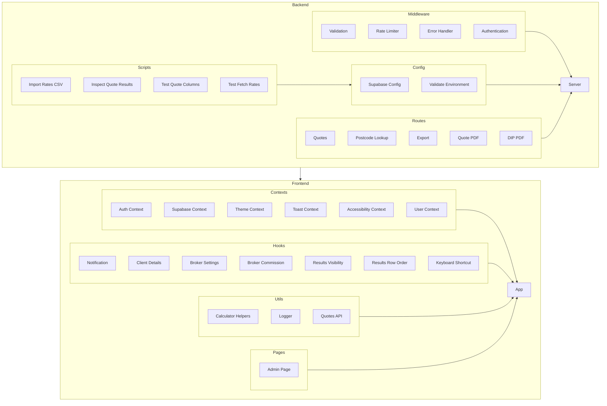

    

    <b>Automatic Architecture Diagrams from Code</b> 
    <a href="https://github.com/swark-io/swark">GitHub</a> • <a href="https://swark.io">Website</a> • <a href="mailto:contact@swark.io">Contact Us</a>

## Usage Instructions

1. **Render the Diagram**: Use the links below to open it in Mermaid Live Editor, or install the [Mermaid Support](https://marketplace.visualstudio.com/items?itemName=bierner.markdown-mermaid) extension.
2. **Recommended Model**: If available for you, use `claude-3.5-sonnet` [language model](vscode://settings/swark.languageModel). It can process more files and generates better diagrams.
3. **Iterate for Best Results**: Language models are non-deterministic. Generate the diagram multiple times and choose the best result.

## Generated Content
**Model**: GPT-4o - [Change Model](vscode://settings/swark.languageModel)  
**Mermaid Live Editor**: [View](https://mermaid.live/view#pako:eNp1Vdtu4yAQ_RXk5-0P5GGlNGnVaLu72bjtC8kDsScOqg0WDL2o6r8vd9tx-5DAOXOYgWEGfxSVrKFYFHvRKNafycN6LwjR5hjgNaueQdSOG7G_eV238MoUBAMhT6zlNUMuBR2mh2TdMYR73nEERd2cRJAFN0pJdceE9aqoBySiLFkaPFP3BwJ5NfY_399KihNv0srS9OzINASWJhhVh4sjwI14SWcAYgFXUnQ26LfRdtIg6OTmn5EW0TBk51up0WX6Xspn09MEScBDHt56qZCG4TBxua1PwSnZrm-zac17Z1hvtiN6vsWyUrzHvMdN5_y7m9A0zP0VabIqn7LrjdA9VOhj0gjCVsgOtGlxON0D6KhzsyhaydZ0YioKIb3oFrA6h7CX2y5Bvdg6CEM0DiVHrq5-RkkwhXuc0eFaZnRMheeHOvGxJ5V_a68dvywthLchla4iI-erMwkOX1SfF43LbyJ8OEOXVR7MJZJpzBIHZpJlVYHW_Mhbju95Y2NytuRRg0pKN78QzHNwZ4s2J-CPRH6KDekMdEzkGKuW2xZaAzLeai8LDIlUFl4r-QyqBEQumqAMFEnchXQlu47bw8XoUTywwyMUivaJp0R4fWTJQF8u-KtqUBPtTr4Sz2bpL3g_Sqbq8mx7qTLo5Ykkif02oY9oU5BTxdrKtAyl8jQdMLmDtgc1ZOBeNo1tlDBMnwu93G7iI0Ts9NvQW9YMb9ey7rhwDPUzb7xcuex7an-H3Hu-HXw7WTqwvkCmlD_LlPKhx1RuwvjV8bahD4sfRQeqY7y236uPfYGuR_bFguyLGk7MXs2--LQi07une82ZPWFXLFAZ-FEwg7J8F1XCSprmXCxOrNXw-R_8kl-S) | [Edit](https://mermaid.live/edit#pako:eNp1Vdtu4yAQ_RXk5-0P5GGlNGnVaLu72bjtC8kDsScOqg0WDL2o6r8vd9tx-5DAOXOYgWEGfxSVrKFYFHvRKNafycN6LwjR5hjgNaueQdSOG7G_eV238MoUBAMhT6zlNUMuBR2mh2TdMYR73nEERd2cRJAFN0pJdceE9aqoBySiLFkaPFP3BwJ5NfY_399KihNv0srS9OzINASWJhhVh4sjwI14SWcAYgFXUnQ26LfRdtIg6OTmn5EW0TBk51up0WX6Xspn09MEScBDHt56qZCG4TBxua1PwSnZrm-zac17Z1hvtiN6vsWyUrzHvMdN5_y7m9A0zP0VabIqn7LrjdA9VOhj0gjCVsgOtGlxON0D6KhzsyhaydZ0YioKIb3oFrA6h7CX2y5Bvdg6CEM0DiVHrq5-RkkwhXuc0eFaZnRMheeHOvGxJ5V_a68dvywthLchla4iI-erMwkOX1SfF43LbyJ8OEOXVR7MJZJpzBIHZpJlVYHW_Mhbju95Y2NytuRRg0pKN78QzHNwZ4s2J-CPRH6KDekMdEzkGKuW2xZaAzLeai8LDIlUFl4r-QyqBEQumqAMFEnchXQlu47bw8XoUTywwyMUivaJp0R4fWTJQF8u-KtqUBPtTr4Sz2bpL3g_Sqbq8mx7qTLo5Ykkif02oY9oU5BTxdrKtAyl8jQdMLmDtgc1ZOBeNo1tlDBMnwu93G7iI0Ts9NvQW9YMb9ey7rhwDPUzb7xcuex7an-H3Hu-HXw7WTqwvkCmlD_LlPKhx1RuwvjV8bahD4sfRQeqY7y236uPfYGuR_bFguyLGk7MXs2--LQi07une82ZPWFXLFAZ-FEwg7J8F1XCSprmXCxOrNXw-R_8kl-S)

