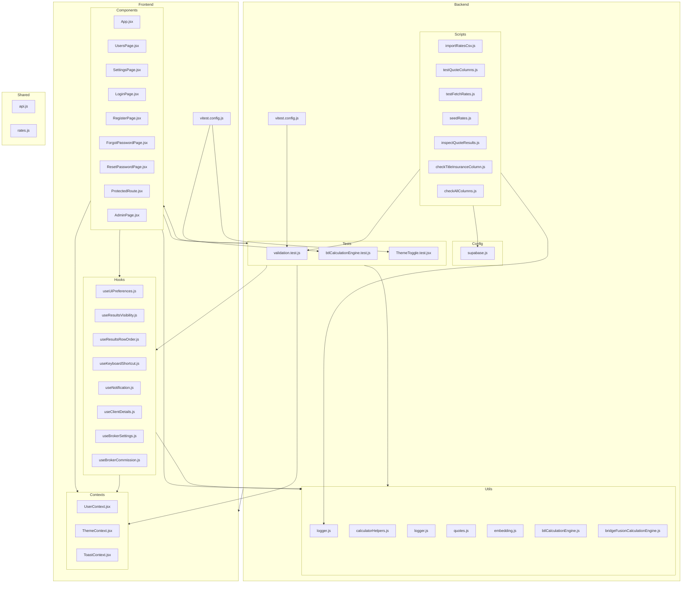

    

    <b>Automatic Architecture Diagrams from Code</b> 
    <a href="https://github.com/swark-io/swark">GitHub</a> • <a href="https://swark.io">Website</a> • <a href="mailto:contact@swark.io">Contact Us</a>

## Usage Instructions

1. **Render the Diagram**: Use the links below to open it in Mermaid Live Editor, or install the [Mermaid Support](https://marketplace.visualstudio.com/items?itemName=bierner.markdown-mermaid) extension.
2. **Recommended Model**: If available for you, use `claude-3.5-sonnet` [language model](vscode://settings/swark.languageModel). It can process more files and generates better diagrams.
3. **Iterate for Best Results**: Language models are non-deterministic. Generate the diagram multiple times and choose the best result.

## Generated Content
**Model**: GPT-4o - [Change Model](vscode://settings/swark.languageModel)  
**Mermaid Live Editor**: [View](https://mermaid.live/view#pako:eNqNVtty2yAQ_RWNnpt8gB86kzj1pNNO69pOX6o-YLSWqRGoXHKZTP69i4SQQLLTFw2cPWe1wO7Ca05lCfkiL0SlSHPMdneFyDJt9930ltATiNJhI3RLFWuM7tAsY3UjldkQA3qpH38VeQxc_9FF_rsnI2Z-WGlgKbmthUZ6Ck0FKzD02Prz9AGIyRqg7HlhHFOY0A3Q7ocb0JYbR55BYxk9Aj3tmOHwWWiriKA-XBSftc24uOF8WHmCjOnTXV9KcWBVWKltyJ5o6FC3XA9cdvJgGA8Hx2VVgUJtN7is3OG2B-Uj4awkhknhYPQwANfufGZdPTJnCgF302vazgdBS4-ScKWkMHP7gWkmQAxR3TQN-sUvensebfyDBqXXpAK0hnHC2YIxTFQ9bTxNmF9lxYSnhXHC2UDFtAHlaeNpwlxJVUmzJlo_SVV6_hSc-NeQiiZYolkrzG1qsCikNU4QAwn7pqzDKsM44ryTXJRwajkxUt0Db3DTXb6nWFwgXRr2xz2bl1n215Woc9YNYiPUeyhLPDi0h3FM2Ru-9GFgtn4SeIBujXNwIlSsrGBlNdpnPVyyX66teylPYeOshge2VnAABdhJ3FJTKA4Mrb5l_WSa7Rln5qUTTeBzwo18-q7KthdMwYnoC7zsJVHl9ohtnlrTqVJ0IvsmDTsw2u5KJxkjE_qSMyzuOzAEs6rjR9BEcKvkCVRfuZ0ixs5IsJPUTOsQVoq-25cNPA9dyHUYj_l-42dJhe2OUMNAHE9TpiRt3-yZo-k7FRk17bkU9-17NvvTRo53sYtxh0XJe-FuQHr-8-XOPyrv_74BtkeiwPsiDQtXCI7HAar2xdEbVXz3B6_-TZNdXX2Mrhb_qmnx-HZNrV1bStH4TnTW4YZqCaE9Jnio_gQfJ1ZiCufaaifsAQ3_bBWeOL43B3yGGiIbq4ffjI_1zBbMnXxLPZeMF0VJ_hUi_5DXoGrCSnzDvuLb0BGKfJEVeQkHgl2syN-QZBsMC-4YwXyq84VRFj7kxBq5fRG0nytpq2O-OBCu4e0fTQLZ3A) | [Edit](https://mermaid.live/edit#pako:eNqNVtty2yAQ_RWNnpt8gB86kzj1pNNO69pOX6o-YLSWqRGoXHKZTP69i4SQQLLTFw2cPWe1wO7Ca05lCfkiL0SlSHPMdneFyDJt9930ltATiNJhI3RLFWuM7tAsY3UjldkQA3qpH38VeQxc_9FF_rsnI2Z-WGlgKbmthUZ6Ck0FKzD02Prz9AGIyRqg7HlhHFOY0A3Q7ocb0JYbR55BYxk9Aj3tmOHwWWiriKA-XBSftc24uOF8WHmCjOnTXV9KcWBVWKltyJ5o6FC3XA9cdvJgGA8Hx2VVgUJtN7is3OG2B-Uj4awkhknhYPQwANfufGZdPTJnCgF302vazgdBS4-ScKWkMHP7gWkmQAxR3TQN-sUvensebfyDBqXXpAK0hnHC2YIxTFQ9bTxNmF9lxYSnhXHC2UDFtAHlaeNpwlxJVUmzJlo_SVV6_hSc-NeQiiZYolkrzG1qsCikNU4QAwn7pqzDKsM44ryTXJRwajkxUt0Db3DTXb6nWFwgXRr2xz2bl1n215Woc9YNYiPUeyhLPDi0h3FM2Ru-9GFgtn4SeIBujXNwIlSsrGBlNdpnPVyyX66teylPYeOshge2VnAABdhJ3FJTKA4Mrb5l_WSa7Rln5qUTTeBzwo18-q7KthdMwYnoC7zsJVHl9ohtnlrTqVJ0IvsmDTsw2u5KJxkjE_qSMyzuOzAEs6rjR9BEcKvkCVRfuZ0ixs5IsJPUTOsQVoq-25cNPA9dyHUYj_l-42dJhe2OUMNAHE9TpiRt3-yZo-k7FRk17bkU9-17NvvTRo53sYtxh0XJe-FuQHr-8-XOPyrv_74BtkeiwPsiDQtXCI7HAar2xdEbVXz3B6_-TZNdXX2Mrhb_qmnx-HZNrV1bStH4TnTW4YZqCaE9Jnio_gQfJ1ZiCufaaifsAQ3_bBWeOL43B3yGGiIbq4ffjI_1zBbMnXxLPZeMF0VJ_hUi_5DXoGrCSnzDvuLb0BGKfJEVeQkHgl2syN-QZBsMC-4YwXyq84VRFj7kxBq5fRG0nytpq2O-OBCu4e0fTQLZ3A)

